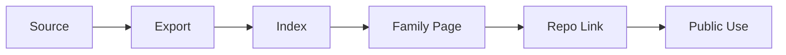

# Architecture Diagrams

## Overview

This repository is the visual asset hub for the MCGR ecosystem and the wider Infinity Info Systems research portfolio.
It should also be easy to reference from the parent MCGR page so the diagram library is visible as part of the larger ecosystem.

It brings together source diagrams, exported assets, and reference visuals that support:

- MCGR framework storytelling
- governance and policy visuals
- SRE and resilience models
- observability and incident views
- FinOps and cost accountability graphics
- AI governance and decision flow diagrams
- enterprise architecture blueprints
- public research papers and web pages

## Diagram Categories

- MCGR framework diagrams and ecosystem maps
- SRE operating model diagrams
- observability and anomaly flow diagrams
- disaster recovery governance diagrams
- FinOps governance diagrams
- multi-cloud governance diagrams
- enterprise architecture blueprints
- AI governance reference models
- executive summary visuals

## Purpose

This repository supports:

- public research papers
- SSRN publications
- conference submissions
- Infinity Info Systems website
- GitHub framework repositories
- architecture review and advisory materials
- brand and web presentation assets
- publication figures and appendix visuals
- reusable diagram families
- cross-repository visual consistency

## Visual Flow



## Where This Fits In The Ecosystem

- [MCGR Framework](../MCGR-Framework/README.md)
- [MCGR Public Page](../MCGR-Framework/README.md#featured-research-spotlight)
- [Multi-Cloud Governance Model](../multi-cloud-governance-model/README.md)
- [SLO-Driven Cloud Architecture](../slo-driven-cloud-architecture/README.md)
- [DR Governance Framework](../dr-governance-framework/README.md)
- [AI-Driven Observability Framework](../ai-driven-observability-framework/README.md)
- [Cloud Risk and Compliance Controls](../cloud-risk-compliance-controls/README.md)

## Content Model

This repository works best when the content is grouped into three layers:

- family pages and visual guidance
- indexes and references
- source files and exports

## Recommended Workflow

1. Draft the diagram structure in a source format.
2. Export SVG, PNG, and PDF variants when the design is stable.
3. Place final exports in the matching family folder.
4. Update the family README and the index pages.
5. Link diagrams back to the related repo or publication.
6. Keep the naming and captioning consistent across all exports.

## Recommended File Types

```text
.svg   preferred for web and GitHub
.png   preferred for papers and presentations
.drawio source diagrams
.vsdx  Visio source diagrams
.pdf   publication-ready diagrams
```

## How To Use This Repo

1. Choose the diagram family that matches the topic.
2. Keep source files and exports together.
3. Publish export-ready assets for papers and web pages.
4. Link back to the corresponding framework repository.
5. Update the evidence indexes as diagrams are added or revised.
6. Keep the visual language consistent across all family folders.

## Shared Direction

Use this repository as the visual backbone for the broader framework ecosystem. Each diagram should reinforce the same narrative: one enterprise model, many connected capabilities.

## Operating Principle

Every visual should be easy to reuse, easy to trace, and consistent with the story the repository is telling.

## Quick View

| Diagram Family | Primary Use | Typical Export |
| --- | --- | --- |
| MCGR | Ecosystem and framework overview | SVG / PNG / PDF |
| Governance | Policy and control flow | SVG / PNG |
| SRE / Observability | Signals and incident flow | SVG / PNG |
| DR | Recovery and failover logic | SVG / PDF |
| FinOps | Cost governance and allocation | SVG / PNG |
| AI Governance | Review and risk flow | SVG / PNG |
| Enterprise Architecture | Capabilities and roadmaps | SVG / PDF |

## Asset Layers

| Layer | Question | Artifact |
| --- | --- | --- |
| Source | What is editable? | Draw.io / Visio |
| Export | What is publishable? | SVG / PNG / PDF |
| Index | What is findable? | Diagram index |
| Family | What is the story? | Family README |
| Reuse | Where is it referenced? | Parent repo / website |

## Ecosystem Links

- [MCGR-Framework](../MCGR-Framework/README.md)
- [Multi-Cloud Governance Model](../multi-cloud-governance-model/README.md)
- [SLO-Driven Cloud Architecture](../slo-driven-cloud-architecture/README.md)
- [DR Governance Framework](../dr-governance-framework/README.md)
- [AI-Driven Observability Framework](../ai-driven-observability-framework/README.md)
- [Cloud Risk and Compliance Controls](../cloud-risk-compliance-controls/README.md)

## Core Content

- [Architecture Map Index](evidence/architecture-map-index.md)
- [Diagram Index](evidence/diagram-index.md)
- [Content Index](docs/content-index.md)
