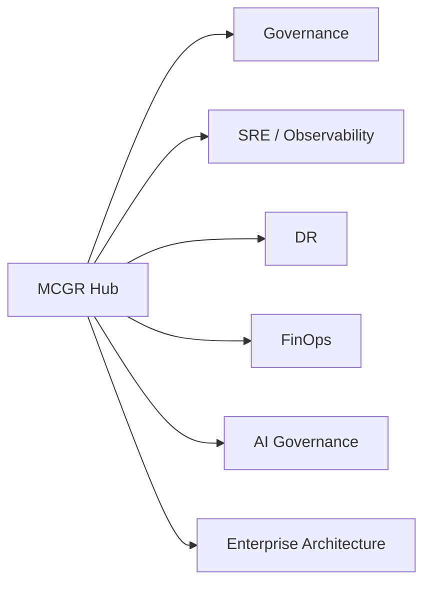

# Diagram Index

| Diagram Category | Purpose | Status | Parent Repo |
| --- | --- | --- | --- |
| MCGR Framework | Multi-cloud governance and SRE model | Ready for reuse | MCGR-Framework |
| SRE Operating Model | Reliability engineering lifecycle | Ready for reuse | SRE Reliability Models |
| AI Observability | Predictive monitoring and anomaly detection | Ready for reuse | AI-Driven Observability Framework |
| Disaster Recovery | Failover/failback governance model | Ready for reuse | DR Governance Framework |
| FinOps Governance | Cloud cost optimization lifecycle | Ready for reuse | Cloud FinOps Governance |
| Policy Drift Detection | Governance and control validation | Ready for reuse | Multi-Cloud Governance Model |
| Enterprise Architecture | Capability and transformation blueprints | Ready for reuse | Enterprise Architecture Blueprints |

## Usage Notes

- Use the MCGR framework family as the master reference for shared ecosystem visuals.
- Reuse the same labels and terminology across diagrams and repositories.
- Keep the index descriptive enough that someone can find the right visual without opening every file.

## Figure

## Registry Rule

Every diagram should be traceable to a family, a source file, an export type, and a parent repository reference.
